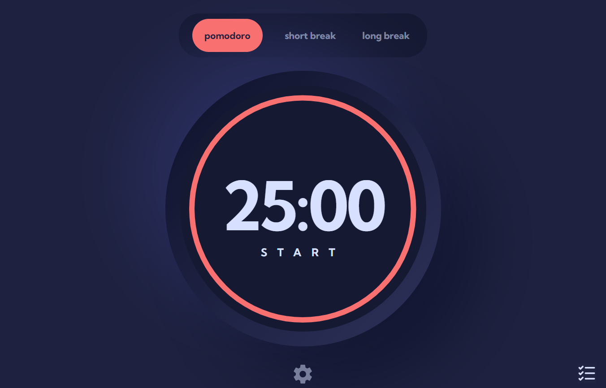

# Pomodoro app



## Quick start
```bash
# Install dependencies
npm install

# Serve on localhost:3000
npm start

# Build for production
npm run build
```

## Features

- Set a pomodoro timer and short & long break timers
- Customize how long each timer runs for
- See a circular progress bar that updates every minute and represents how far through their timer they are
- Customize the appearance of the app with the ability to set preferences for colors and fonts

## Deploy to GitHub Pages
Check out the reference [here](https://github.com/gitname/react-gh-pages)